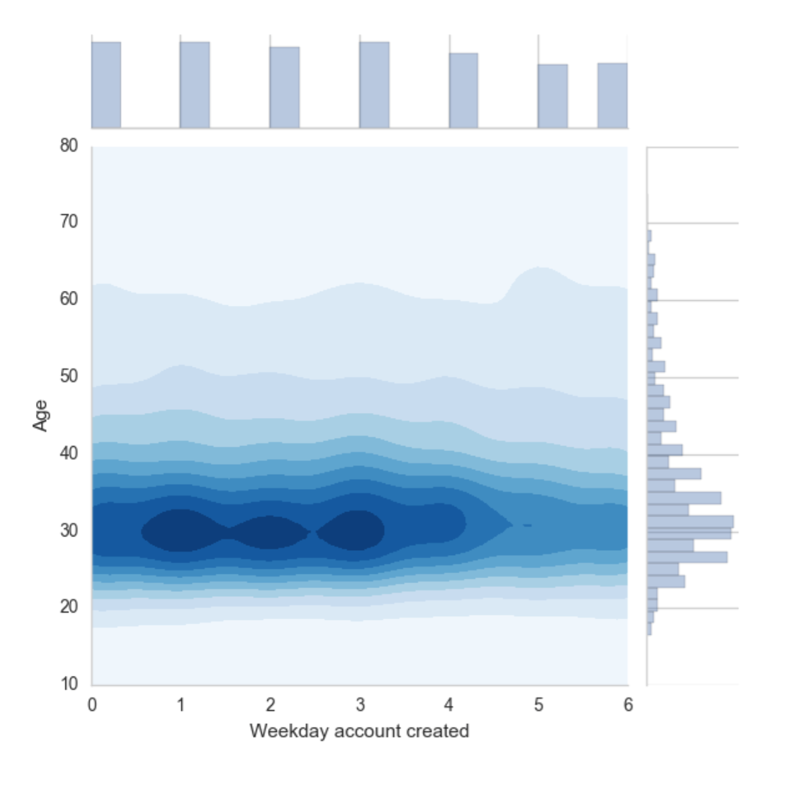

<body>

    

        

    <section id="content">
        <article>
            <header class="page-header">
                <h1>
                    <a href="http://dshatalov.com/2016/05/introduction-to-data-science/"
                       rel="bookmark"
                       title="Permalink to Introduction to Data Science">
                        Introduction to Data Science
                    </a>
                </h1>
            </header>
            

                

                    

<footer class="post-info">
    Date
    
        <i class="fa fa-calendar"></i><time datetime="2016-05-14T20:00:00-05:00"> Sat 14 May 2016</time>
    

    
</footer><!-- /.post-info -->                    

                

                
As most of us know Python is widely used for scientific purposes. Recently I have done a few steps in this direction learning how to visualize data using very powerful APIs that are available today. Primarily this post is about my first personal experience of handling raw data and making good visualizations using different visualizing techniques. 

For this project my team used <strong>Airbnb data</strong> that we found on <a href="https://www.kaggle.com/c/airbnb-recruiting-new-user-bookings">Kaggle</a>. Our aim was to understand Airbnb users' booking behavior so that the company was able to target the right customers by customized marketing skills and expand the user community.

As a member of a team I worked on exploring and visualizing user demographics, one of the directions our team decided to take. First, I explored correlations between categories of our highly categorical data using <a href="http://www.tableau.com/">Tableau</a>. I believe that it is a good tool for starting exploring your data since it does not require much effort to format and handle data sets, and you can create nice simple graphs pretty easily. Tableau helped me to find first patterns and contribute many graphs (heatmaps, stacked bar and line graphs). Most of these graphs were later used by the team as a first step towards deep exploratory analysis. 

To continue working on visualizations demanding more complex techniques I wanted to choose a tool that would be useful for analyzing categorical data. Having experience with Python I came across some very powerful APIs for graphical analysis such as Seaborn, Pandas, and Matplotlib. 

Eventually, I came up with two visualizations using Seaborn API. I found their <a href="https://stanford.edu/~mwaskom/software/seaborn/api.html">documentation and examples</a> very handy. 

I created the <strong>counter plot</strong> that showed which weekdays were more and less popular for creating account and highlighted the age distribution. Combining this plot with histograms on the axises (JointGrid function of “Seaborn” library gave me a hand) allowed me to explore and explain some patterns.

For the second visualization I used the <strong>violin plot</strong>. It allowed me to combine multiple aspects of data in a single graph and find interesting patterns. With the help of Python APIs I compared four years of observations and plotted it as a single graph. 

<h3>Lessons learned</h3>
<ul>
<li>80% of work in Data Science is spent on handling data and only 20% - on visualizing it. </li>
<li>It is very important and at the same time very difficult to choose a proper visualization technique that will clearly show some patterns in your data. Experimenting worked for me.</li>
<li>It is always a bad idea to fit your data to some technique. It should be the other way round. </li>
<li>Python itself and a great collection of visualization tools created for it make this language one of the best options for Data Science.</li>
</ul>
            

            <!-- /.entry-content -->
    

        </article>
    </section>

        

        

            <aside>

<section class="well well-sm">
    <ul class="list-group list-group-flush">
            <li class="list-group-item"><h4><i class="fa fa-home fa-lg"></i>Social</h4>
              <ul class="list-group" id="social">
                <li class="list-group-item"><a href="https://www.facebook.com/shatalov.da"><i class="fa fa-facebook-square fa-lg"></i> Facebook</a></li>
                <li class="list-group-item"><a href="https://twitter.com/DmitryShatalov"><i class="fa fa-twitter-square fa-lg"></i> Twitter</a></li>
                <li class="list-group-item"><a href="https://github.com/shatalovdm"><i class="fa fa-github-square fa-lg"></i> GitHub</a></li>
              </ul>
            </li>

            <li class="list-group-item"><h4><i class="fa fa-home fa-lg"></i>Recent Posts</h4>
                <ul class="list-group" id="recentposts">
                    <li class="list-group-item">
                        <a href="http://dshatalov.com/2016/06/hands-on-experience-with-web2py/">
                            Hands-on experience with Web2py
                        </a>
                    </li>
                    <li class="list-group-item">
                        <a href="http://dshatalov.com/2016/05/introduction-to-data-science/">
                            Introduction to Data Science
                        </a>
                    </li>
                    <li class="list-group-item">
                        <a href="http://dshatalov.com/2016/04/testing-pelican/">
                            Testing pelican
                        </a>
                    </li>
                </ul>
            </li>

    </ul>
</section>
            </aside>
        

    

</body>
</html>
